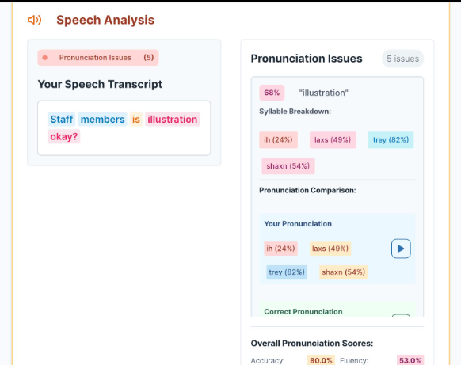
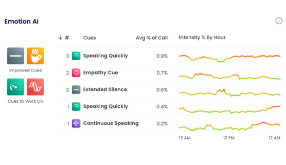
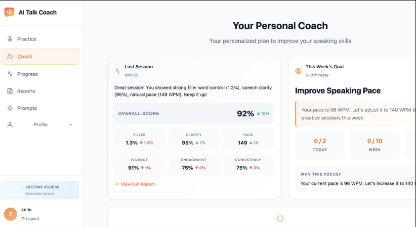

# 🎤 Personal Speech Coach Using AI

An AI-powered web application that helps users improve their public speaking skills by analyzing speech and providing intelligent feedback. The system evaluates speech quality and offers suggestions to improve confidence, fluency, and communication.

---

## 📖 Project Overview

The **Personal Speech Coach Using AI** is designed to assist students, professionals, and anyone who wants to improve their speaking skills. Users can upload or record speech, and the AI analyzes the audio to provide meaningful feedback for improvement.

---

## ✨ Features

- 🎙️ Speech Upload/Recording
- 🤖 AI-Based Speech Analysis
- 🗣️ Pronunciation Evaluation
- 📊 Fluency Assessment
- 💬 Personalized Feedback
- 📈 Speech Performance Report
- 🎯 Suggestions for Improvement
- 💻 Simple and User-Friendly Interface

---

## 🛠️ Technologies Used

### Frontend

- HTML5
- CSS3

### Backend

- Python
- Flask

### AI Libraries

- SpeechRecognition
- NumPy
- Scikit-learn

---

## 📁 Project Structure

```text
student-003-personal-speech-coach-using-ai/
│
├── screenshot/
│   ├── 1.PNG
│   ├── 2.PNG
│   └── 3.PNG
│
├── static/
│   ├── css/
│   └── images/
│
├── templates/
│
├── app.py
├── requirements.txt
└── README.md
```

---

## 🚀 Installation

### Clone the Repository

```bash
git clone https://github.com/indra-institute-of-education/student-003-personal-speech-coach-using-ai.git
```

### Navigate to the Project

```bash
cd student-003-personal-speech-coach-using-ai
```

### Create a Virtual Environment (Optional)

#### Windows

```bash
python -m venv venv
venv\Scripts\activate
```

#### Linux/macOS

```bash
python3 -m venv venv
source venv/bin/activate
```

### Install Dependencies

```bash
pip install -r requirements.txt
```

### Run the Application

```bash
python app.py
```

The application will start on your local machine.

---

## 💡 How It Works

1. Open the application.
2. Upload or record a speech.
3. The AI processes the speech.
4. Analyzes pronunciation and fluency.
5. Generates a speech performance report.
6. Provides personalized suggestions for improvement.

---

## 📸 Screenshots

| 🎤 Speech Analysis | 📊 AI Integration |
|-------------------|-------------------|
|  |  |

<br>

<div align="center">

### 🏠 Home Page



</div>

---

## 🎯 Future Enhancements

- Real-time speech coaching
- Multi-language support
- Emotion analysis
- Voice confidence scoring
- AI conversation practice
- Cloud deployment

---

## 🤝 Contributing

Contributions are welcome!

1. Fork the repository.
2. Create a new branch.
3. Commit your changes.
4. Push to your branch.
5. Open a Pull Request.

---

## 👨‍💻 Developed By

**Indra Institute of Education**

Student AI Project

---

## ⭐ Support

If you like this project, don't forget to **⭐ Star** the repository on GitHub!

---
